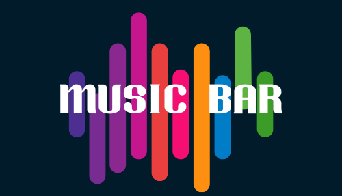

# 🎶 Music Bar - Web Player: Music for Everyone 🎵

## Overview 🌟

Music Bar is a web-based music player that allows users to explore their music library, play songs, and manage playlists. The application is designed for ease of use and provides a seamless music playback experience. Users can view albums, play songs, adjust volume, and navigate through tracks effortlessly. 🎧

## Live Project Link 🌐

Check out the live project at [🎧 Music Bar](https://musicbar.freewebhostmost.com/)

## Video Demonstration 🎥

Watch the video demonstration of the project here: [Video Link](insert-your-video-url-here)

## Technologies Used 🛠️

- **HTML5**: For structuring the web application. 🌐
- **CSS3**: For styling the application and ensuring a responsive design. 🎨
- **JavaScript**: For dynamic interactions and music playback functionalities. ⚙️
- **Fetch API**: For loading music files and album information from the server. 📡
- **SVGs**: For scalable vector graphics used in UI elements. 🖼️

## Key Learnings 📚

- Gained proficiency in using JavaScript for manipulating audio elements and handling events. 🎓
- Enhanced understanding of web technologies, including HTML, CSS, and the Fetch API. 🔍
- Learned how to structure a music library and display information dynamically. 📁
- Improved skills in responsive design to cater to different devices. 📱

## Key Features ⭐

- **Dynamic Music Library**: Automatically generates a list of albums and songs based on the folder structure. 📂
- **Song Playback**: Play, pause, next, and previous controls for managing music playback. ▶️⏸️
- **Volume Control**: Easily adjustable volume levels with mute functionality. 🔊
- **Seek Bar**: Navigate through songs with a seek bar that updates in real-time. ⏳
- **Responsive Design**: Adapts to various screen sizes for an optimal user experience. 📏

## Additional Future Features 🚀

- **Playlist Management**: Allow users to create and save custom playlists. 📝
- **Search Functionality**: Implement a search bar for users to find specific songs or albums quickly. 🔍
- **User Authentication**: Enable users to create accounts and save their preferences. 🔑
- **Music Recommendations**: Add a feature that suggests music based on user preferences and listening history. 🎶

## License 📜

This project is licensed under the [MIT License](https://opensource.org/licenses/MIT). 📝

## Conclusion 🎉

Music Bar aims to provide a fun and user-friendly music listening experience while helping me learn and apply various web development skills. Thank you for checking out the project! 🌟
